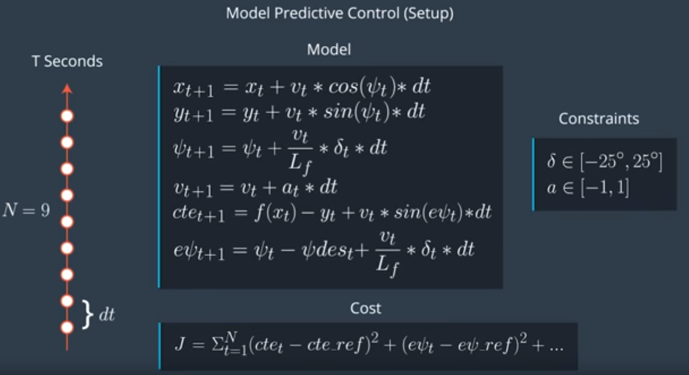

# CarND-MPC-Project
Self-Driving Car Engineer Nanodegree Program
Alistair Kirk August 2017

---

## Writeup and Reflection
This project explores the creation of the Model Predictive Control (MPC) for use with the Term 2 Simulator. The goal is to automate steering of the test vehicle around the lake track loop, while dealing with prediction and latency.

The sensor input to our program provides the current steering angle, and throttle, vehicle velocity, bearing, and global x and y coordinates.

Additional input includes a set of global coordinates representing the road centerline waypoints ahead of the vehicle which is used to calculate the Cross Track Error (CTE) and bearing error of the vehicle.

Video of the functioning MPC project can be found on Youtube:
* [self driving car nanodegree program MPC Project: Shows the car successfully driving around the whole test track twice.](https://youtu.be/0eK-djsJhzw)

## The Model

The majority of the MPC theory and code style was taken from the Udacity course, with additional learning from resources listed at the end of this document.

The model received as input: data about the current location of the vehicle, and a list of track centreline waypoints, that are used to calculate the current track error, and the error between the vehicle bearing and the centerline bearing

The model was constructed from the equations described in the figure below (from Udacity):



#### State
The state equation (the block called Model in the figure) used in this controller is built from six variables:

Variable | Description
--- | ---
x | x coordinate of the vehicle
y | y coordinate of the vehicle
psi | vehicle bearing
v | vehicle velocity
cte | distance from centerline
epsi | error of the bearing and centerline

#### Actuators
The actuators (the block labeled Constraints in the figure) consist of only two variables:

Variable | Description
--- | ---
delta | steering angle of the vehicle
a | acceleration of the vehicle

These correspond to the available inputs in the simulator vehicle: the steering angle and the throttle.

#### Update Equations / Cost Functions
The Cost Functions (the block labelled Cost in the figure) are a set of equations built for each variable in the state equation. They are set as the difference between the current value and a reference value and are used in the minimization algorithm FG_Eval, learned in the course.

The intent here is to minimize the error between the current track location and the centerline (CTE), and the error between the current bearing and the expected track bearing (epsi). There is also a desire to set a desired velocity, in this case the reference velocity is 72 miles per hour, which was the maximum stable speed found for my model.

The following code shows how the reference values are incorporated into the cost function:

```
// Define reference values for error correction. We want to minimize cte error and psi error, and travel at the ref velocity
  double cte_ref = 0;
  double epsi_ref = 0;
  double vel_ref = 72; // in miles per hour
  
// The part of the cost based on the reference state.
	for (size_t t = 0; t < N; t++) {
		fg[0] += 100 * CppAD::pow(vars[cte_start + t] - cte_ref, 2);
		fg[0] += 100 * CppAD::pow(vars[epsi_start + t] - epsi_ref, 2);
		fg[0] += 150 * CppAD::pow(vars[v_start + t] - vel_ref, 2);
	}

	// Minimize the use of actuators.
	for (size_t t = 0; t < N - 1; t++) {
		fg[0] += 10 * CppAD::pow(vars[delta_start + t], 2);
		fg[0] += 100 * CppAD::pow(vars[a_start + t], 2);
	}

	// Minimize the value gap between sequential actuations.
	for (size_t t = 0; t < N - 2; t++) {
		fg[0] += 10000 * CppAD::pow(vars[delta_start + t + 1] - vars[delta_start + t], 2);
		fg[0] += 10000 * CppAD::pow(vars[a_start + t + 1] - vars[a_start + t], 2);
	}
```

It is important to note that the cost function for each variable was modified by a weighting factor, which allowed the model to smooth the transition the set time steps, instead of instantaneously jumping to the desired value.

The weights are summarized in the following table:

Variable | Weight
--- | ---
CTE reference | 100
epsi reference | 100
velocity reference | 150
steering angle | 10
throttle | 100
steering angle actuation | 10,000
throttle actuation | 10,000

The throttle actuation and steering actuation were given a high weight to smooth out the transition between the current state and the next desired state over the given number of timesteps. This prevented an instantaeous change in those variables.

The throttle weight of 100 was chosen to stop oscillation of the throttle around the reference point.

All of the weights were manually tuned with the Timestep Length and Elapsed Duration.

## Timestep Length and Elapsed Duration (N & dt)
Student discusses the reasoning behind the chosen N (timestep length) and dt (elapsed duration between timesteps) values. Additionally the student details the previous values tried.

The prediction horizon is the duration over which future predictions are made, this is referred to as *T*.

*T* is the product of two other variables, *N* and *dt*.

The timestep length *N* is the number of timesteps to the horizon. The Elapsed Duration *dt* is how much time elapses between actuations. For example, if *N* were 20 and *dt* were 0.5, then *T* would be 10 seconds.

In my model, I have set *N* and *dt*  as follows:

```
size_t N = 10;
double dt = 0.05;
```

The values were manually tuned for the course and desired velocity.

Other values of N were tried (some has high as 20 and 30) but the performance of the MPC suffered because there were a large number of optimizations to be solved in real time.

Other values of dt were also tried: values of 0.1 to 0.2 resulted in discretization errors in the sharper turns of the course (the model could not respond quickly enough); and lower values of 0.01 were tried which caused the MPC performance to suffer - The value of N also had to be increased at these lower timesteps so that the overall time horizon remained feasible. 

## Polynomial Fitting and MPC Preprocessing
A polynomial is fitted to waypoints.
If the student preprocesses waypoints, the vehicle state, and/or actuators prior to the MPC procedure it is described.

The waypoints were preprocessed to be in the vehicle's reference frame in the following manner:

```
// Rotate and shift such that new reference system is centered on the origin at 0 degrees 
		  
		  for (size_t i = 0; i < ptsx.size(); ++i) {

			  double shift_x = ptsx[i] - px;
			  double shift_y = ptsy[i] - py;

			  ptsx[i] = shift_x * cos(-psi) - shift_y * sin(-psi);
			  ptsy[i] = shift_x * sin(-psi) + shift_y * cos(-psi);
		  }
```

3rd Degree Polynomial Coefficients were then fit to the track waypoints and their coefficients stores in variables *coeffs* :

```
// Calc coefficients by fitting polynomial (polyfit and polyeval provided above)
		  auto coeffs = polyfit(ptsx_transform, ptsy_transform, 3);
		  double cte = polyeval(coeffs, 0);
```

This coordinate transformation allowed for simpler prediction of the state variables in the next timestep because the values of x, y and psi could be set at zero (see state equations in figure above):

```
// Using these substitutions in the t+1 prediction equations:
		  double x_pred = 0.0 + v * d_t;
		  double y_pred = 0.0;
		  double psi_pred = 0.0 + v / Lf * kronickerdelta * d_t;
		  double v_pred = v + a*d_t;
		  double cte_pred = cte - 0.0 + v*sin(-psi_des_t)*d_t;
		  double epsi_pred = 0.0 - psi_des_t + v * kronickerdelta / Lf * d_t;
```

Here *kronickerdelta* is the negative current steering angle from the sensor. *Lf* is the distance between the turn radius of the car model and the center of gravity, which was found empirically as 2.67 and provided by Udacity. 

The timestep *d_t* was set at 0.1 s, and is used to account for the latency of the model.

These predicted states were then combined in a vector *state*, which was used in the MPC solver to get the steering and throttle values:

```
auto vars = mpc.Solve(state, coeffs);
```

The steering value and throttle value for the next timestep were returned by mpc.Solve, along with a set of x and y coordinates for the path ahead. Lastly the steering value had to be normalized back to a range expected by the simulator:

```
		  // Normalize the steering value:
		  steer_value = -1*steer_value / deg2rad(25) / Lf;
```

The steering angle and throttle values were then transmitted back to the simulator.

## Model Predictive Control with Latency
The student implements Model Predictive Control that handles a 100 millisecond latency. Student provides details on how they deal with latency.

Latency was a challenge to deal with in the simulator but it more accurately reflects real time performance of autonomous vehicles and it was successfully dealt with in this model.

The latency of 100 ms was used, and the method is described in detail in the section above. To recap: The future state of the variables was predicted using the state equations and a selected timestep of 0.1 s (100 ms).

### Future considerations:
* Dynamic speed selection: go faster on straight-aways but slow down on the curves, possibly varying speed depending on DOT standard radius of curve. This would improve corner handling but would need a way to predict if you were in a tight turn or not
## References:
[webSocket Data Input](https://github.com/udacity/CarND-MPC-Project/blob/master/DATA.md)
